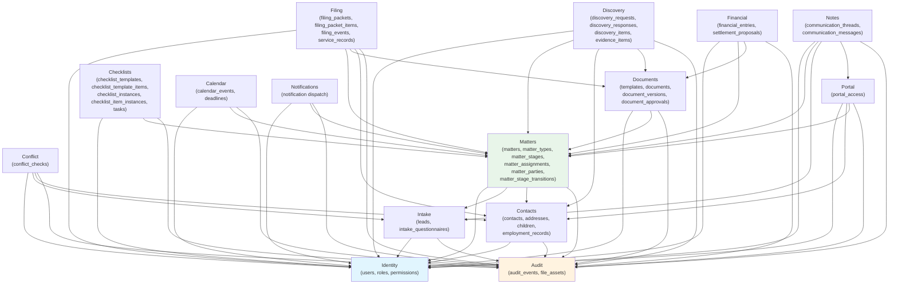

# Module Boundary Specification -- Ttaylor Family Law Paralegal Platform

**Version**: 1.0.0
**Source of Truth**: `/SCHEMA_CANON.md`
**Last Updated**: 2026-04-21

---

## Golden Rule

**No circular dependencies.** If Module A depends on Module B, Module B must not depend on Module A, directly or transitively.

Cross-module communication happens exclusively through:
1. **Imported service functions** (direct function calls, allowed only in the dependency direction)
2. **BullMQ job dispatch** (fire-and-forget decoupling -- any module may enqueue a job; only the owning module processes it)
3. **Audit event emission** (every module calls the Audit module's service; Audit depends on nothing)

---

## Module Dependency Graph

---

## Module Specifications

### 1. Identity

**Purpose**: Manages user accounts, roles, and permissions. Provides authentication and authorization primitives consumed by all other modules.

**Owns these tables**: `users`, `roles`, `permissions`, `user_roles`, `role_permissions`

**Exposes these tRPC procedures**:

| Procedure | Type | Description |
|---|---|---|
| `identity.users.list` | query | List users with pagination and role filters |
| `identity.users.getById` | query | Get a single user by ID |
| `identity.users.create` | mutation | Create a new staff user |
| `identity.users.update` | mutation | Update user profile fields |
| `identity.users.deactivate` | mutation | Soft-deactivate a user (set is_active=false) |
| `identity.users.enrollMfa` | mutation | Generate and store TOTP secret for MFA |
| `identity.users.verifyMfa` | mutation | Verify TOTP code and enable MFA |
| `identity.roles.list` | query | List all roles |
| `identity.roles.create` | mutation | Create a custom role |
| `identity.roles.update` | mutation | Update role name/description |
| `identity.roles.assignToUser` | mutation | Assign a role to a user |
| `identity.roles.removeFromUser` | mutation | Remove a role from a user |
| `identity.permissions.list` | query | List all permissions |
| `identity.permissions.getByRole` | query | Get permissions for a given role |
| `identity.auth.login` | mutation | Authenticate and return session token |
| `identity.auth.logout` | mutation | Invalidate session |
| `identity.auth.refreshToken` | mutation | Refresh auth token |
| `identity.auth.me` | query | Get current authenticated user with roles and permissions |

**Accepts external inputs**: Login requests from web clients and portal clients. Clerk webhook for session management.

**Emits these events/jobs**:
- Audit: `user.created`, `user.updated`, `user.deactivated`, `user.login`, `user.logout`, `role.assigned`, `role.removed`
- BullMQ: `identity.send-welcome-email` (on user creation), `identity.mfa-enrolled` (on MFA enrollment)

**Boundary rules**:
- MUST NOT import from any other module except Audit.
- MUST NOT read from any tables outside its own.
- All other modules depend on Identity for auth context; Identity depends on nothing (except Audit for logging).

---

### 2. Intake

**Purpose**: Manages the lead pipeline from initial contact through qualification. Handles intake questionnaires and the conversion workflow that feeds into Matters.

**Owns these tables**: `leads`, `intake_questionnaires`

**Exposes these tRPC procedures**:

| Procedure | Type | Description |
|---|---|---|
| `intake.leads.list` | query | List leads with status/source filters and pagination |
| `intake.leads.getById` | query | Get a single lead with questionnaire data |
| `intake.leads.create` | mutation | Create a new lead |
| `intake.leads.update` | mutation | Update lead fields |
| `intake.leads.updateStatus` | mutation | Transition lead status |
| `intake.leads.assignTo` | mutation | Assign a lead to an intake specialist |
| `intake.leads.convertToMatter` | mutation | Convert a qualified lead into a matter |
| `intake.questionnaires.getByLead` | query | Get all questionnaires for a lead |
| `intake.questionnaires.create` | mutation | Start a new questionnaire for a lead |
| `intake.questionnaires.update` | mutation | Save questionnaire responses (partial or complete) |
| `intake.questionnaires.markComplete` | mutation | Mark questionnaire as completed |

**Accepts external inputs**: Web form submissions (public intake form), phone intake data entered by receptionist.

**Emits these events/jobs**:
- Audit: `lead.created`, `lead.updated`, `lead.statusChanged`, `lead.assigned`, `lead.converted`, `questionnaire.completed`
- BullMQ: `intake.send-confirmation-email` (on lead creation), `intake.trigger-conflict-check` (on questionnaire completion), `notifications.send` (lead status change notifications)

**Boundary rules**:
- MUST NOT import from Matters, Documents, Filing, or any downstream module.
- MAY import from Identity (for user lookups and auth context).
- The `leads.convertToMatter` mutation calls Matters module's service to create the matter record.

---

### 3. Conflict

**Purpose**: Performs conflict-of-interest checks against the contacts database before a lead can be converted to a matter. Manages both automated and manual conflict search workflows.

**Owns these tables**: `conflict_checks`

**Exposes these tRPC procedures**:

| Procedure | Type | Description |
|---|---|---|
| `conflict.checks.runForLead` | mutation | Run automated conflict check for a lead |
| `conflict.checks.getByLead` | query | Get all conflict checks for a lead |
| `conflict.checks.getById` | query | Get a single conflict check with details |
| `conflict.checks.attorneyClear` | mutation | Attorney clears a conflict check |
| `conflict.checks.addManualResult` | mutation | Record manual conflict check results |

**Accepts external inputs**: Triggered by Intake module after questionnaire completion. May also be triggered manually by paralegal.

**Emits these events/jobs**:
- Audit: `conflict.checked`, `conflict.cleared`, `conflict.found`
- BullMQ: `conflict.run-automated-search` (searches contacts and matter_parties tables), `notifications.send` (conflict found alert to attorney)

**Boundary rules**:
- MUST NOT import from Matters, Documents, Filing, or any downstream module.
- MAY import from Identity (auth context), Intake (lead data), Contacts (search contacts database).
- Reads from `contacts` and `matter_parties` tables for conflict searches but does not write to them.

---

### 4. Contacts

**Purpose**: Central people registry for all individuals associated with matters -- clients, opposing parties, attorneys, judges, witnesses, children, and their related records (addresses, employment, children details).

**Owns these tables**: `contacts`, `addresses`, `children`, `employment_records`

**Exposes these tRPC procedures**:

| Procedure | Type | Description |
|---|---|---|
| `contacts.list` | query | List contacts with type/name filters and pagination |
| `contacts.getById` | query | Get a single contact with addresses, children, employment |
| `contacts.search` | query | Full-text search across contact names |
| `contacts.create` | mutation | Create a new contact |
| `contacts.update` | mutation | Update contact fields |
| `contacts.delete` | mutation | Soft-delete a contact |
| `contacts.addresses.list` | query | List addresses for a contact |
| `contacts.addresses.create` | mutation | Add an address |
| `contacts.addresses.update` | mutation | Update an address |
| `contacts.addresses.delete` | mutation | Remove an address |
| `contacts.children.list` | query | List children records for a contact |
| `contacts.children.create` | mutation | Create a child record |
| `contacts.children.update` | mutation | Update child details |
| `contacts.employment.list` | query | List employment records for a contact |
| `contacts.employment.create` | mutation | Add employment record |
| `contacts.employment.update` | mutation | Update employment record |

**Accepts external inputs**: Manual data entry by staff. Portal client profile updates (limited fields).

**Emits these events/jobs**:
- Audit: `contact.created`, `contact.updated`, `contact.deleted`, `address.created`, `child.created`, `employment.created`
- BullMQ: none (Contacts is a passive data module)

**Boundary rules**:
- MUST NOT import from Matters, Documents, Filing, Discovery, Financial, or any workflow module.
- MAY import from Identity (auth context) and Audit.
- Other modules reference contacts by ID but do not write to the contacts tables directly.

---

### 5. Matters

**Purpose**: The core case management module. Manages matter lifecycle, stage progression, staff assignments, and party associations. Central hub that most other modules reference.

**Owns these tables**: `matters`, `matter_types`, `matter_stages`, `matter_assignments`, `matter_parties`, `matter_stage_transitions`

**Exposes these tRPC procedures**:

| Procedure | Type | Description |
|---|---|---|
| `matters.list` | query | List matters with status/type/county filters and pagination |
| `matters.getById` | query | Get a single matter with assignments, parties, current stage |
| `matters.create` | mutation | Create a new matter (usually from lead conversion) |
| `matters.update` | mutation | Update matter fields (title, county, court, urgency) |
| `matters.updateStage` | mutation | Transition matter to a new stage (validates gates) |
| `matters.updateStatus` | mutation | Change high-level status (active, on_hold, closed, archived) |
| `matters.close` | mutation | Close a matter (validates all required items complete) |
| `matters.archive` | mutation | Archive a closed matter |
| `matters.assignments.list` | query | List staff assigned to a matter |
| `matters.assignments.assign` | mutation | Assign a staff member to a matter |
| `matters.assignments.remove` | mutation | Remove a staff assignment |
| `matters.parties.list` | query | List parties on a matter |
| `matters.parties.add` | mutation | Add a party to a matter |
| `matters.parties.update` | mutation | Update a party's role |
| `matters.parties.remove` | mutation | Remove a party from a matter |
| `matters.types.list` | query | List matter types |
| `matters.stages.listByType` | query | List stages for a matter type in order |
| `matters.transitions.list` | query | List stage transition history for a matter |

**Accepts external inputs**: Lead conversion from Intake module. Stage transition requests from various workflow modules.

**Emits these events/jobs**:
- Audit: `matter.created`, `matter.updated`, `matter.stageChanged`, `matter.statusChanged`, `matter.closed`, `matter.archived`, `assignment.created`, `assignment.removed`, `party.added`, `party.removed`
- BullMQ: `checklists.generate-from-template` (on matter creation), `notifications.send` (on stage change, assignment, closure), `calendar.create-default-deadlines` (on matter creation)

**Boundary rules**:
- MUST NOT import from Documents, Filing, Discovery, Financial, Notes, or Portal.
- MAY import from Identity (auth, user lookups), Intake (lead data for conversion), Contacts (party data), Checklists (stage gate validation), Audit.
- Matters is the most-referenced module. It provides read-only matter context to downstream modules but does not reach into their domain.

---

### 6. Documents

**Purpose**: Manages document templates, document generation via template merge, version control, and the attorney review/approval workflow.

**Owns these tables**: `templates`, `documents`, `document_versions`, `document_approvals`

**Exposes these tRPC procedures**:

| Procedure | Type | Description |
|---|---|---|
| `documents.list` | query | List documents for a matter with type/status filters |
| `documents.getById` | query | Get a document with current version and approval history |
| `documents.create` | mutation | Create a new document (manual upload or from template) |
| `documents.update` | mutation | Update document metadata |
| `documents.delete` | mutation | Soft-delete a document |
| `documents.updateStatus` | mutation | Transition document status |
| `documents.generate` | mutation | Trigger template merge to generate document |
| `documents.submitForReview` | mutation | Submit document for internal review |
| `documents.submitForAttorneyReview` | mutation | Submit document for attorney review |
| `documents.approve` | mutation | Attorney approves a document (hard gate) |
| `documents.reject` | mutation | Attorney rejects a document with comments |
| `documents.requestRevision` | mutation | Internal reviewer requests revision |
| `documents.versions.list` | query | List all versions of a document |
| `documents.versions.create` | mutation | Upload a new version |
| `documents.versions.getById` | query | Get a specific version |
| `documents.templates.list` | query | List document templates with category/matter-type filters |
| `documents.templates.getById` | query | Get a template with merge field definitions |
| `documents.templates.create` | mutation | Create a new template |
| `documents.templates.update` | mutation | Update template fields |
| `documents.approvals.list` | query | List approval records for a document |

**Accepts external inputs**: File uploads from staff. Template merge data from matter/contact/financial records.

**Emits these events/jobs**:
- Audit: `document.created`, `document.updated`, `document.deleted`, `document.statusChanged`, `document.generated`, `document.submitted`, `document.approved`, `document.rejected`, `version.created`
- BullMQ: `documents.generate-from-template` (template merge job), `documents.virus-scan` (scan uploaded file_assets), `notifications.send` (review requests, approval/rejection notifications)

**Boundary rules**:
- MUST NOT import from Filing, Discovery, Financial, Notes, or Portal.
- MAY import from Identity (auth), Matters (matter context, party data for merge fields), Contacts (contact data for merge fields), Audit.
- Documents reads from Contacts and Matters for template merge but does not write to those tables.

---

### 7. Filing

**Purpose**: Manages the grouping of documents into filing packets, attorney approval of packets, e-filing submission, and court acceptance/rejection tracking. Also tracks service of process.

**Owns these tables**: `filing_packets`, `filing_packet_items`, `filing_events`, `service_records`

**Exposes these tRPC procedures**:

| Procedure | Type | Description |
|---|---|---|
| `filing.packets.list` | query | List filing packets for a matter with status filters |
| `filing.packets.getById` | query | Get a packet with items and event history |
| `filing.packets.create` | mutation | Create a new filing packet |
| `filing.packets.update` | mutation | Update packet metadata |
| `filing.packets.addItem` | mutation | Add a document to the packet |
| `filing.packets.removeItem` | mutation | Remove a document from the packet |
| `filing.packets.reorderItems` | mutation | Reorder items within the packet |
| `filing.packets.markDocumentsComplete` | mutation | Transition to DOCUMENTS_COMPLETE |
| `filing.packets.submitForAttorneyReview` | mutation | Submit packet for attorney review |
| `filing.packets.attorneyApprove` | mutation | Attorney approves packet (hard gate) |
| `filing.packets.attorneyReject` | mutation | Attorney rejects packet |
| `filing.packets.submitToCourt` | mutation | Submit approved packet via e-filing |
| `filing.packets.recordAcceptance` | mutation | Record court acceptance |
| `filing.packets.recordRejection` | mutation | Record court rejection |
| `filing.packets.startCorrection` | mutation | Begin correcting a rejected packet |
| `filing.packets.archive` | mutation | Archive an accepted filing |
| `filing.service.list` | query | List service records for a matter |
| `filing.service.create` | mutation | Record service of process |
| `filing.service.update` | mutation | Update service record |
| `filing.service.recordReturn` | mutation | Record return of service |
| `filing.events.list` | query | List filing events for a packet |

**Accepts external inputs**: E-filing system callbacks (acceptance/rejection notifications). Manual entry of service records.

**Emits these events/jobs**:
- Audit: `filing.created`, `filing.submitted`, `filing.accepted`, `filing.rejected`, `filing.corrected`, `filing.archived`, `service.recorded`, `service.returnReceived`
- BullMQ: `filing.submit-to-efiling` (e-filing API integration), `filing.track-submission` (poll for e-filing status), `notifications.send` (acceptance/rejection/deficiency alerts)

**Boundary rules**:
- MUST NOT import from Intake, Conflict, Discovery, Financial, Notes, or Portal.
- MAY import from Identity (auth), Matters (matter context), Documents (document status verification), Contacts (service recipient data), Audit.
- Filing reads document statuses but does not update document records. Document status changes (e.g., FILED) are triggered by the Documents module reacting to filing events.

---

### 8. Checklists

**Purpose**: Manages checklist templates, generates matter-specific checklist instances, and tracks individual item completion. Also owns ad-hoc tasks that are not part of a formal checklist.

**Owns these tables**: `checklist_templates`, `checklist_template_items`, `checklist_instances`, `checklist_item_instances`, `tasks`

**Exposes these tRPC procedures**:

| Procedure | Type | Description |
|---|---|---|
| `checklists.templates.list` | query | List checklist templates with matter-type filters |
| `checklists.templates.getById` | query | Get a template with all items |
| `checklists.templates.create` | mutation | Create a new checklist template |
| `checklists.templates.update` | mutation | Update template metadata |
| `checklists.templates.addItem` | mutation | Add an item to a template |
| `checklists.templates.updateItem` | mutation | Update a template item |
| `checklists.templates.removeItem` | mutation | Remove a template item |
| `checklists.templates.reorderItems` | mutation | Reorder items within a template |
| `checklists.instances.listByMatter` | query | List checklist instances for a matter |
| `checklists.instances.getById` | query | Get an instance with all item statuses |
| `checklists.instances.generate` | mutation | Generate a checklist instance from a template |
| `checklists.items.updateStatus` | mutation | Transition an item's status |
| `checklists.items.assign` | mutation | Assign an item to a user |
| `checklists.items.complete` | mutation | Mark an item complete |
| `checklists.items.waive` | mutation | Attorney waives an item (hard gate) |
| `checklists.items.skip` | mutation | Skip a non-required item |
| `checklists.items.block` | mutation | Mark an item as blocked |
| `checklists.items.unblock` | mutation | Unblock an item |
| `checklists.stageGateCheck` | query | Check if all stage-gated items are complete for a given stage |
| `checklists.tasks.list` | query | List ad-hoc tasks with filters |
| `checklists.tasks.getById` | query | Get a single task |
| `checklists.tasks.create` | mutation | Create an ad-hoc task |
| `checklists.tasks.update` | mutation | Update a task |
| `checklists.tasks.complete` | mutation | Complete a task |

**Accepts external inputs**: Template management from admin interface. Item status updates from paralegal dashboard.

**Emits these events/jobs**:
- Audit: `checklist.generated`, `checklistItem.statusChanged`, `checklistItem.completed`, `checklistItem.waived`, `checklistItem.skipped`, `task.created`, `task.completed`
- BullMQ: `checklists.check-dependencies` (cascade unblock when an item completes), `notifications.send` (item assignment, overdue item reminders, stage gate block notifications)

**Boundary rules**:
- MUST NOT import from Documents, Filing, Discovery, Financial, Notes, or Portal.
- MAY import from Identity (auth, user assignment), Matters (matter context, stage gate validation), Audit.
- The Matters module calls `checklists.stageGateCheck` before allowing stage transitions.

---

### 9. Calendar

**Purpose**: Manages calendar events (hearings, mediations, depositions, meetings) and court/statutory deadlines with reminder scheduling.

**Owns these tables**: `calendar_events`, `deadlines`

**Exposes these tRPC procedures**:

| Procedure | Type | Description |
|---|---|---|
| `calendar.events.list` | query | List events with date range and matter filters |
| `calendar.events.getById` | query | Get a single event |
| `calendar.events.create` | mutation | Create a calendar event |
| `calendar.events.update` | mutation | Update an event |
| `calendar.events.delete` | mutation | Delete an event |
| `calendar.events.listByMatter` | query | List events for a specific matter |
| `calendar.deadlines.list` | query | List deadlines with date range and status filters |
| `calendar.deadlines.getById` | query | Get a single deadline |
| `calendar.deadlines.create` | mutation | Create a deadline |
| `calendar.deadlines.update` | mutation | Update a deadline |
| `calendar.deadlines.complete` | mutation | Mark a deadline as met |
| `calendar.deadlines.extend` | mutation | Extend a deadline (record new date) |
| `calendar.deadlines.waive` | mutation | Waive a deadline |
| `calendar.deadlines.listUpcoming` | query | List deadlines due within N days |

**Accepts external inputs**: Manual event creation. Automated deadline creation from Matters module on stage transitions.

**Emits these events/jobs**:
- Audit: `event.created`, `event.updated`, `event.deleted`, `deadline.created`, `deadline.completed`, `deadline.extended`, `deadline.overdue`
- BullMQ: `calendar.schedule-reminders` (schedule reminder notifications based on reminder_days_before / reminder_minutes_before), `calendar.check-overdue-deadlines` (daily cron job), `notifications.send` (reminder and overdue notifications)

**Boundary rules**:
- MUST NOT import from Documents, Filing, Discovery, Financial, Notes, or Portal.
- MAY import from Identity (auth), Matters (matter context), Audit.

---

### 10. Discovery

**Purpose**: Tracks discovery requests (outgoing and incoming), responses, individual discovery items, and evidence cataloging for trial preparation.

**Owns these tables**: `discovery_requests`, `discovery_responses`, `discovery_items`, `evidence_items`

**Exposes these tRPC procedures**:

| Procedure | Type | Description |
|---|---|---|
| `discovery.requests.list` | query | List discovery requests for a matter |
| `discovery.requests.getById` | query | Get a request with items and response status |
| `discovery.requests.create` | mutation | Create a discovery request record |
| `discovery.requests.update` | mutation | Update request fields |
| `discovery.requests.updateStatus` | mutation | Transition request status |
| `discovery.responses.create` | mutation | Create a response to a request |
| `discovery.responses.update` | mutation | Update response fields |
| `discovery.responses.updateStatus` | mutation | Transition response status |
| `discovery.items.list` | query | List items within a request |
| `discovery.items.create` | mutation | Add an item to a request |
| `discovery.items.update` | mutation | Update an item (response text, objection) |
| `discovery.items.updateStatus` | mutation | Transition item status |
| `discovery.evidence.list` | query | List evidence items for a matter |
| `discovery.evidence.getById` | query | Get a single evidence item |
| `discovery.evidence.create` | mutation | Catalog a new evidence item |
| `discovery.evidence.update` | mutation | Update evidence details |
| `discovery.evidence.markAdmitted` | mutation | Record court admission of evidence |

**Accepts external inputs**: Manual data entry. Document uploads for discovery responses and evidence.

**Emits these events/jobs**:
- Audit: `discovery.requestCreated`, `discovery.responseCreated`, `discovery.responseServed`, `discovery.itemAnswered`, `evidence.cataloged`, `evidence.admitted`
- BullMQ: `calendar.create-deadline` (discovery response deadlines), `notifications.send` (upcoming discovery deadlines, overdue responses)

**Boundary rules**:
- MUST NOT import from Filing, Financial, Notes, or Portal.
- MAY import from Identity (auth), Matters (matter context), Contacts (served-on/received-from contacts), Documents (linked discovery documents), Audit.

---

### 11. Financial

**Purpose**: Manages billing, trust accounting, fee tracking, and settlement proposals. Handles financial entries for time-based billing, flat fees, costs, and trust ledger operations.

**Owns these tables**: `financial_entries`, `settlement_proposals`

**Exposes these tRPC procedures**:

| Procedure | Type | Description |
|---|---|---|
| `financial.entries.list` | query | List financial entries for a matter with type/date filters |
| `financial.entries.getById` | query | Get a single financial entry |
| `financial.entries.create` | mutation | Record a financial entry |
| `financial.entries.update` | mutation | Update an entry (pre-approval only) |
| `financial.entries.approve` | mutation | Approve a financial entry |
| `financial.entries.summaryByMatter` | query | Get financial summary for a matter (total billed, paid, outstanding, trust balance) |
| `financial.entries.exportReport` | query | Export financial report for a date range |
| `financial.settlements.list` | query | List settlement proposals for a matter |
| `financial.settlements.getById` | query | Get a single proposal with terms |
| `financial.settlements.create` | mutation | Record a settlement proposal |
| `financial.settlements.update` | mutation | Update proposal details |
| `financial.settlements.updateStatus` | mutation | Transition proposal status |
| `financial.trustLedger` | query | Get trust ledger for a matter (deposits, disbursements, running balance) |

**Accepts external inputs**: Manual time entries from attorneys/paralegals. Payment recording. Settlement proposal data.

**Emits these events/jobs**:
- Audit: `financial.entryCreated`, `financial.entryApproved`, `financial.paymentRecorded`, `financial.trustDeposit`, `financial.trustDisbursement`, `settlement.proposed`, `settlement.accepted`, `settlement.rejected`
- BullMQ: `notifications.send` (payment confirmation, overdue invoice reminders, trust balance alerts)

**Boundary rules**:
- MUST NOT import from Intake, Conflict, Filing, Notes, or Portal.
- MAY import from Identity (auth), Matters (matter context), Documents (linked settlement documents), Audit.

---

### 12. Notes

**Purpose**: Manages communication threads and messages associated with matters and leads. Supports internal staff threads, client portal messaging, phone logs, and email logs.

**Owns these tables**: `communication_threads`, `communication_messages`

**Exposes these tRPC procedures**:

| Procedure | Type | Description |
|---|---|---|
| `notes.threads.list` | query | List threads for a matter with channel filters |
| `notes.threads.getById` | query | Get a thread with messages |
| `notes.threads.create` | mutation | Create a new thread |
| `notes.threads.update` | mutation | Update thread subject or privilege flag |
| `notes.messages.list` | query | List messages in a thread with pagination |
| `notes.messages.create` | mutation | Post a new message |
| `notes.messages.markRead` | mutation | Mark a message as read |
| `notes.messages.listUnread` | query | List unread messages for the current user |

**Accepts external inputs**: Staff message input. Portal client messages (via Portal module). Phone/email log entries.

**Emits these events/jobs**:
- Audit: `thread.created`, `message.created`, `message.read`
- BullMQ: `notifications.send` (new message notification to thread participants), `portal.notify-new-message` (push notification to portal client)

**Boundary rules**:
- MUST NOT import from Documents, Filing, Discovery, Financial, Checklists, or Calendar.
- MAY import from Identity (auth, sender identity), Matters (matter context), Intake (lead context), Portal (portal sender identity), Audit.

---

### 13. Notifications

**Purpose**: Manages notification templates, queuing, and delivery. Processes notification jobs dispatched by other modules and handles multi-channel delivery (in-app, email, SMS).

**Owns these tables**: none (stateless queue processor; uses BullMQ for state)

**Note**: Notifications does not own database tables. It operates as a BullMQ worker that processes `notifications.send` jobs. Delivery history is logged via audit events. If persistent notification storage is needed in the future, a `notification_log` table would be added here.

**Exposes these tRPC procedures**:

| Procedure | Type | Description |
|---|---|---|
| `notifications.preferences.get` | query | Get notification preferences for the current user |
| `notifications.preferences.update` | mutation | Update notification preferences |
| `notifications.history.list` | query | List sent notifications for the current user (from audit events) |
| `notifications.send` | mutation | Manually trigger a notification (admin only) |

**Accepts external inputs**: BullMQ jobs from all other modules. Admin manual send.

**Emits these events/jobs**:
- Audit: `notification.sent`, `notification.failed`, `notification.bounced`
- BullMQ: `notifications.send-email` (email delivery), `notifications.send-sms` (SMS delivery), `notifications.send-push` (in-app push)

**Boundary rules**:
- MUST NOT import from any domain module (Documents, Filing, Discovery, etc.).
- MAY import from Identity (user contact info for delivery), Matters (matter context for notification templates), Audit.
- All notification content is passed in the BullMQ job payload; the Notifications module does not query domain tables.

---

### 14. Portal

**Purpose**: Manages client portal access, authentication, and the bridge between external client interactions and internal matter data. Provides a security-isolated view for clients.

**Owns these tables**: `portal_access`

**Exposes these tRPC procedures**:

| Procedure | Type | Description |
|---|---|---|
| `portal.access.listByMatter` | query | List portal access grants for a matter |
| `portal.access.getById` | query | Get a single portal access record |
| `portal.access.grant` | mutation | Grant portal access to a contact for a matter |
| `portal.access.revoke` | mutation | Revoke portal access |
| `portal.access.resetPassword` | mutation | Reset portal client password |
| `portal.auth.login` | mutation | Portal client login |
| `portal.auth.logout` | mutation | Portal client logout |
| `portal.client.getMatter` | query | Get client-visible matter summary |
| `portal.client.getDocuments` | query | Get documents shared with client |
| `portal.client.getMessages` | query | Get messages in client portal threads |
| `portal.client.sendMessage` | mutation | Send a message in a portal thread |
| `portal.client.uploadDocument` | mutation | Upload a document (client upload) |

**Accepts external inputs**: Client browser sessions. Client file uploads.

**Emits these events/jobs**:
- Audit: `portal.accessGranted`, `portal.accessRevoked`, `portal.clientLogin`, `portal.clientLogout`, `portal.documentUploaded`, `portal.messageSent`
- BullMQ: `documents.virus-scan` (scan client-uploaded files), `notifications.send` (notify staff of client portal activity)

**Boundary rules**:
- MUST NOT import from Filing, Discovery, Financial, Checklists, Calendar, Intake, or Conflict.
- MAY import from Identity (staff auth for admin operations), Contacts (contact data for portal accounts), Matters (matter-scoped access), Audit.
- Portal provides a STRICTLY limited view. Client queries filter by the client's `portal_access.matter_id` and cannot access other matters.

---

### 15. Audit

**Purpose**: Provides the append-only audit trail and file asset management. Every module calls Audit to record significant actions. Also manages the `file_assets` table for centralized file storage metadata.

**Owns these tables**: `audit_events`, `file_assets`

**Exposes these tRPC procedures**:

| Procedure | Type | Description |
|---|---|---|
| `audit.events.list` | query | List audit events with resource/actor/matter/date filters |
| `audit.events.getById` | query | Get a single audit event |
| `audit.events.listByResource` | query | List events for a specific resource (e.g., all events for a matter) |
| `audit.events.listByActor` | query | List events performed by a specific actor |
| `audit.events.export` | query | Export audit events as CSV/JSON for a date range |
| `audit.fileAssets.getById` | query | Get file asset metadata |
| `audit.fileAssets.getSignedUrl` | query | Generate a signed URL for file download |
| `audit.fileAssets.upload` | mutation | Upload a file and create file_asset record |
| `audit.fileAssets.updateVirusScan` | mutation | Update virus scan status (system only) |

**Accepts external inputs**: Audit emission calls from every module. File uploads from staff and portal clients. Virus scan results from scanning service.

**Emits these events/jobs**:
- Audit: self-referential (audit events about audit events are not recorded to prevent infinite loops)
- BullMQ: `audit.virus-scan-file` (trigger virus scan on upload), `audit.archive-old-events` (periodic archival job)

**Boundary rules**:
- MUST NOT import from ANY other module. Audit is the leaf node of the dependency graph.
- Every other module imports Audit's service to emit events and manage files.
- The `audit_events` table is append-only. No UPDATE or DELETE operations are permitted at the database level.

---

## Orders and Compliance (Cross-Cutting)

The `orders` and `compliance_items` tables are owned by the **Matters** module since they are directly tied to the matter lifecycle. They are managed through:

| Procedure | Type | Description |
|---|---|---|
| `matters.orders.list` | query | List orders for a matter |
| `matters.orders.getById` | query | Get an order with compliance items |
| `matters.orders.create` | mutation | Record a new court order |
| `matters.orders.update` | mutation | Update order details |
| `matters.compliance.list` | query | List compliance items for an order or matter |
| `matters.compliance.create` | mutation | Create a compliance tracking item |
| `matters.compliance.update` | mutation | Update compliance status |
| `matters.compliance.verify` | mutation | Verify compliance (attorney or paralegal) |
