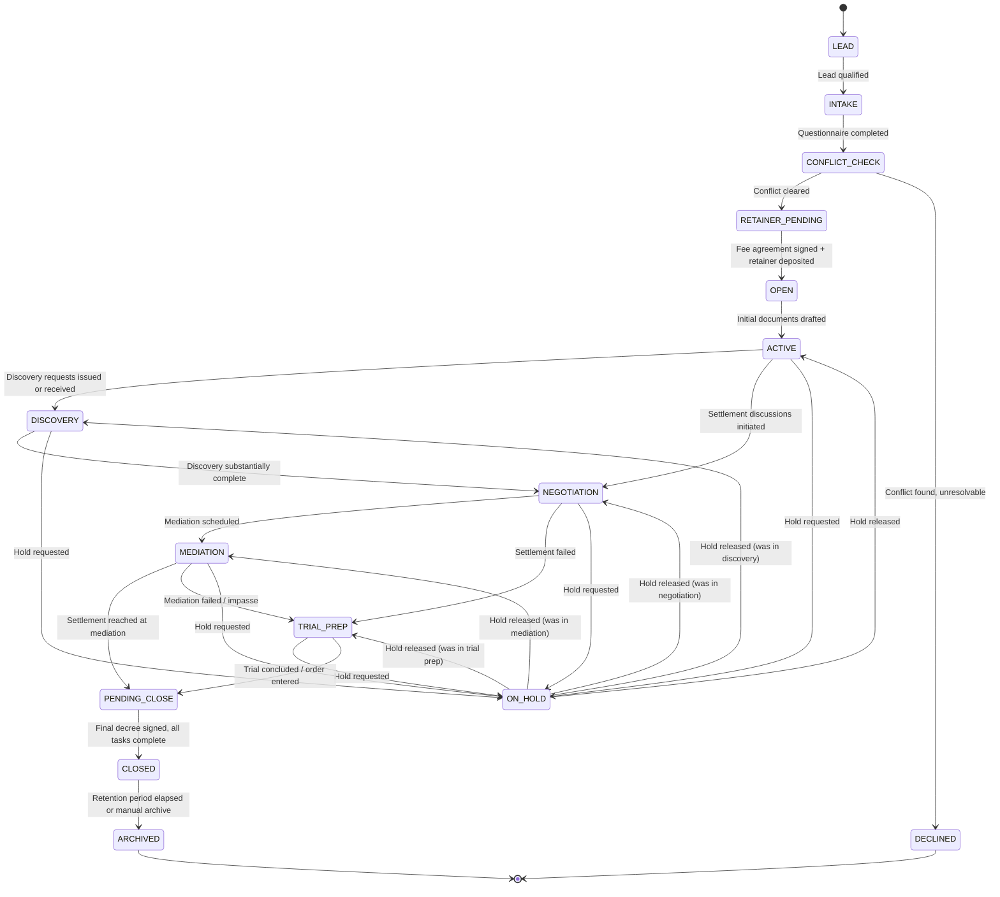
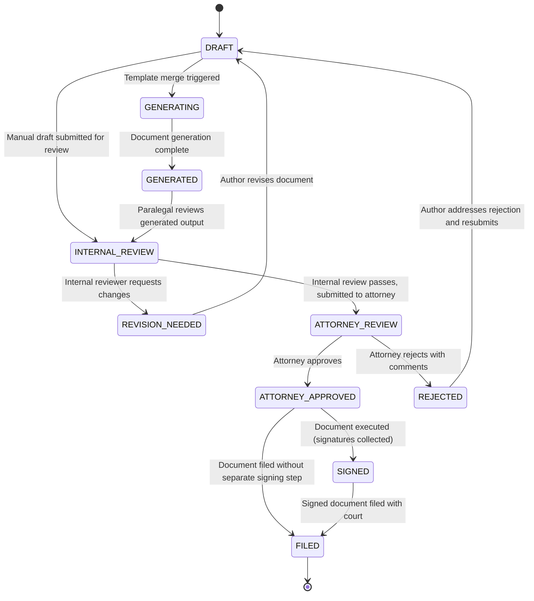
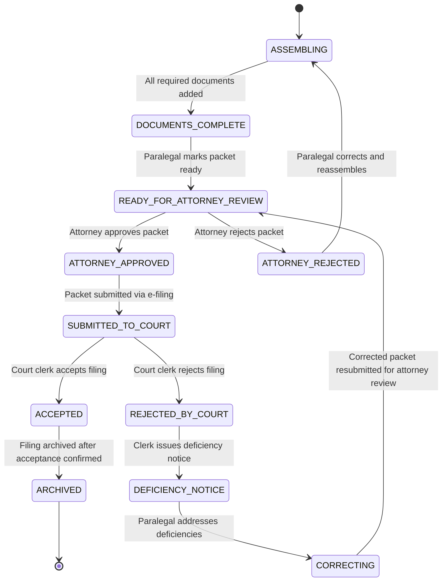
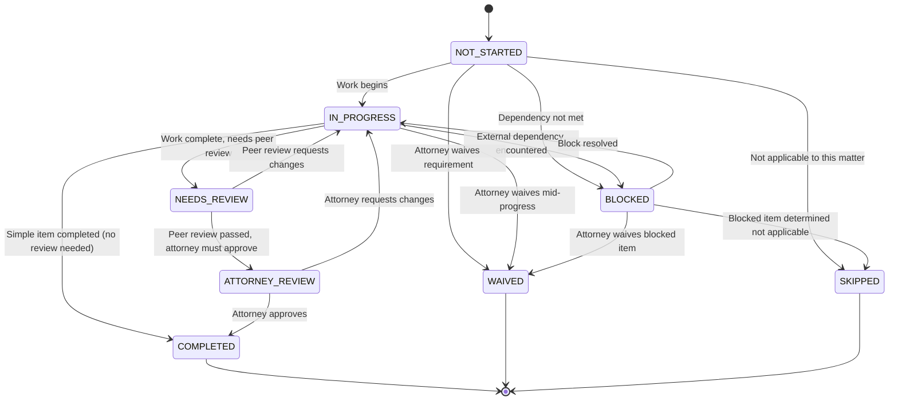

# State Machine Specifications -- Ttaylor Family Law Paralegal Platform

**Version**: 1.0.0
**Source of Truth**: `/SCHEMA_CANON.md`
**Last Updated**: 2026-04-21

This document specifies the state machines for the four critical domain objects. Each state machine defines every legal state, every legal transition, the triggers, actors, system actions, and gates.

---

## 1. Matter State Machine

A matter progresses through stages that map to the lifecycle of a Texas family law case. The `matters.status` column holds the high-level status (active, on_hold, closed, archived), while `matters.current_stage_id` references the specific workflow stage within `matter_stages`.

The state machine below models the combined lifecycle using the stage codes.

### Matter Transition Table

| From State | To State | Trigger | Actor | System Actions | Gates |
|---|---|---|---|---|---|
| (none) | LEAD | New lead created via intake form or manual entry | RECEPTIONIST, PARALEGAL | Create lead record; assign to intake specialist; send intake notification | None |
| LEAD | INTAKE | Intake specialist marks lead as qualified | PARALEGAL, LEGAL_ASSISTANT | Generate intake questionnaire; send questionnaire link to client if portal enabled | Lead must have first_name, last_name, phone or email |
| INTAKE | CONFLICT_CHECK | Intake questionnaire marked complete | PARALEGAL | Run automated conflict check against contacts table; create conflict_check record | Questionnaire `completed_at` must be non-null |
| CONFLICT_CHECK | RETAINER_PENDING | Conflict check cleared by attorney | ATTORNEY (required) | Create matter record with status=active; generate matter_number; send retainer request notification | `conflict_checks.attorney_cleared = true`. Attorney approval required. |
| CONFLICT_CHECK | DECLINED | Conflict found, attorney declines representation | ATTORNEY (required) | Update lead status to 'declined'; send decline notification | Attorney approval required |
| RETAINER_PENDING | OPEN | Fee agreement signed and retainer payment received | PARALEGAL, ATTORNEY | Create fee_agreement financial_entry; generate default checklist from matter_type; assign lead_attorney and lead_paralegal; send welcome notification | `financial_entries` must contain a retainer_deposit for this matter |
| OPEN | ACTIVE | Initial petition or response drafted | PARALEGAL | Create first document record; update checklist items for drafting stage | At least one document must exist for this matter |
| ACTIVE | DISCOVERY | Discovery request issued or received | PARALEGAL | Create discovery_request record; update deadlines; send discovery deadline notification | None |
| ACTIVE | NEGOTIATION | Settlement discussions initiated | ATTORNEY (required) | Create settlement_proposals record; log audit event | Attorney must authorize entering negotiation |
| ACTIVE | ON_HOLD | Hold requested with reason | ATTORNEY (required) | Record hold reason in matter_stage_transitions; pause deadline reminders; send hold notification to assigned staff | Attorney approval required; reason required |
| DISCOVERY | NEGOTIATION | Discovery substantially complete | ATTORNEY (required) | Update discovery_requests to completed where applicable; log transition | Attorney approval required |
| DISCOVERY | ON_HOLD | Hold requested | ATTORNEY (required) | Record previous stage for resume; pause deadlines | Attorney approval required; reason required |
| NEGOTIATION | MEDIATION | Mediation scheduled | PARALEGAL | Create calendar_event for mediation; create mediation-prep checklist items; send mediation notice | calendar_events must contain a mediation event for this matter |
| NEGOTIATION | TRIAL_PREP | Settlement failed | ATTORNEY (required) | Generate trial-prep checklist; create trial deadlines; send notification to team | Attorney approval required |
| NEGOTIATION | ON_HOLD | Hold requested | ATTORNEY (required) | Record previous stage; pause deadlines | Attorney approval required |
| MEDIATION | PENDING_CLOSE | Settlement reached | ATTORNEY (required) | Generate settlement agreement document from template; update settlement_proposals status; create finalization checklist | Attorney approval required |
| MEDIATION | TRIAL_PREP | Mediation impasse declared | ATTORNEY (required) | Log impasse in audit; generate trial-prep checklist; create trial deadlines | Attorney approval required |
| MEDIATION | ON_HOLD | Hold requested | ATTORNEY (required) | Record previous stage; pause deadlines | Attorney approval required |
| TRIAL_PREP | ON_HOLD | Hold requested | ATTORNEY (required) | Record previous stage; pause deadlines | Attorney approval required |
| ON_HOLD | (previous stage) | Hold released | ATTORNEY (required) | Resume deadlines; send resume notification to assigned staff; restore to recorded previous stage | Attorney approval required |
| TRIAL_PREP | PENDING_CLOSE | Trial concluded, order entered | ATTORNEY (required) | Generate final order document; create compliance tracking items; generate close-out checklist | Attorney approval required; order document must exist |
| PENDING_CLOSE | CLOSED | All close-out tasks complete, final decree signed | ATTORNEY (required) | Set `matters.closed_at`; mark checklist as completed; archive deadline reminders; send close confirmation | All required checklist items must be in COMPLETED status; attorney approval required |
| CLOSED | ARCHIVED | Manual archive or retention policy trigger | ADMIN, ATTORNEY | Set `matters.archived_at`; move file_assets to cold storage tier; log archive event | None |

### Transitions Requiring Attorney Approval

The following transitions are hard-gated and require `users.is_attorney = true` for the acting user:

- CONFLICT_CHECK to RETAINER_PENDING (or DECLINED)
- ACTIVE to NEGOTIATION
- ACTIVE/DISCOVERY/NEGOTIATION/MEDIATION/TRIAL_PREP to ON_HOLD
- ON_HOLD to any resumed state
- DISCOVERY to NEGOTIATION
- NEGOTIATION to TRIAL_PREP
- MEDIATION to PENDING_CLOSE or TRIAL_PREP
- TRIAL_PREP to PENDING_CLOSE
- PENDING_CLOSE to CLOSED

---

## 2. Document State Machine

Documents follow a lifecycle from creation through attorney review to filing.

### Document Transition Table

| From State | To State | Trigger | Actor | System Actions | Gates |
|---|---|---|---|---|---|
| (none) | DRAFT | Document created manually or upload initiated | PARALEGAL, LEGAL_ASSISTANT | Create document record; create initial document_version; log audit event | User must have `document:create` permission |
| DRAFT | GENERATING | Template merge triggered for this document | PARALEGAL | Dispatch `document.generate` BullMQ job; set status to GENERATING | `documents.template_id` must be non-null |
| GENERATING | GENERATED | Generation job completes successfully | SYSTEM | Create new document_version with generated file_asset; set `documents.current_version_id`; log audit event | Generation job must succeed |
| DRAFT | INTERNAL_REVIEW | Author submits for internal review | PARALEGAL, LEGAL_ASSISTANT | Send notification to assigned reviewer(s); log audit event | Document must have at least one version |
| GENERATED | INTERNAL_REVIEW | Paralegal reviews generated output and submits | PARALEGAL | Send notification to reviewer(s); log audit event | None |
| INTERNAL_REVIEW | REVISION_NEEDED | Internal reviewer requests changes | PARALEGAL (senior) | Add revision notes to document; send notification to author; log audit event | Reviewer must not be the author |
| INTERNAL_REVIEW | ATTORNEY_REVIEW | Internal review passed | PARALEGAL (senior) | Create document_approvals record with `requested_by`; send notification to assigned attorney; log audit event | At least one attorney must be assigned to the matter |
| REVISION_NEEDED | DRAFT | Author creates a new version addressing feedback | PARALEGAL, LEGAL_ASSISTANT | Create new document_version; increment version_number; update current_version_id | New version must be uploaded or generated |
| ATTORNEY_REVIEW | ATTORNEY_APPROVED | Attorney approves the document | ATTORNEY (required) | Set `document_approvals.decision = 'approved'`; set `document_approvals.decision_at`; log audit event; send approval notification | `users.is_attorney = true` for acting user. This is a HARD GATE -- cannot be bypassed. |
| ATTORNEY_REVIEW | REJECTED | Attorney rejects with comments | ATTORNEY (required) | Set `document_approvals.decision = 'rejected'`; record comments; send rejection notification to author; log audit event | `users.is_attorney = true` for acting user |
| REJECTED | DRAFT | Author revises and resubmits | PARALEGAL, LEGAL_ASSISTANT | Create new document_version; reset workflow; log audit event | Must address rejection comments (enforced procedurally, not technically) |
| ATTORNEY_APPROVED | SIGNED | Signatures collected (wet or electronic) | PARALEGAL | Create new document_version with signed copy; log audit event | Signed file_asset must be uploaded |
| ATTORNEY_APPROVED | FILED | Document filed directly (no separate signing needed) | PARALEGAL | Update status; log audit event | Document must be part of an approved filing_packet |
| SIGNED | FILED | Signed document included in court filing | PARALEGAL | Update status; log audit event | Document must be included in a filing_packet with status >= SUBMITTED |

### Blocking Gates

1. **Attorney Approval Gate**: No document can reach ATTORNEY_APPROVED without an attorney (`users.is_attorney = true`) explicitly setting `document_approvals.decision = 'approved'`. This is enforced in tRPC middleware -- the `documents.approve` mutation checks the actor's `is_attorney` flag.

2. **Version Requirement**: Transitions out of DRAFT require at least one `document_version` to exist.

3. **Generation Completion**: GENERATING to GENERATED is a system-only transition triggered by the BullMQ job callback. No human actor can force this transition.

### What Happens on Rejection

When an attorney rejects a document:
1. The `document_approvals` record is updated with `decision = 'rejected'`, `comments`, and `decision_at`.
2. The document status moves to REJECTED.
3. A notification is sent to the document's `created_by` user.
4. The author must create a new version and re-enter the review pipeline from DRAFT. There is no shortcut back to ATTORNEY_REVIEW -- the document must go through INTERNAL_REVIEW again.

---

## 3. Filing Packet State Machine

Filing packets group documents for court submission. This state machine encodes Harris County e-filing constraints.

### Filing Packet Transition Table

| From State | To State | Trigger | Actor | System Actions | Gates |
|---|---|---|---|---|---|
| (none) | ASSEMBLING | New filing packet created | PARALEGAL | Create filing_packets record; create filing_event (type='assembled'); log audit event | User must have `filing:create` permission; matter must be in ACTIVE or later stage |
| ASSEMBLING | DOCUMENTS_COMPLETE | All required documents added to packet | PARALEGAL | Validate packet completeness (lead document present, all attachments have versions); log audit event | Packet must contain at least one item with `item_role = 'lead_document'`; all included documents must have status = ATTORNEY_APPROVED or later |
| DOCUMENTS_COMPLETE | READY_FOR_ATTORNEY_REVIEW | Paralegal marks packet as ready for attorney review | PARALEGAL | Send notification to lead attorney on matter; create filing_event; log audit event | All filing_packet_items must reference approved document versions |
| READY_FOR_ATTORNEY_REVIEW | ATTORNEY_APPROVED | Attorney approves the filing packet | ATTORNEY (required) | Set `attorney_approved_by` and `attorney_approved_at`; create filing_event (type='approved'); send notification to paralegal; log audit event | `users.is_attorney = true`. HARD GATE -- no bypass. |
| READY_FOR_ATTORNEY_REVIEW | ATTORNEY_REJECTED | Attorney rejects the packet | ATTORNEY (required) | Record rejection reason; create filing_event; send notification to assembling paralegal; log audit event | `users.is_attorney = true` |
| ATTORNEY_REJECTED | ASSEMBLING | Paralegal addresses attorney feedback | PARALEGAL | Reset packet; allow document additions/removals; clear attorney approval fields; log audit event | None |
| ATTORNEY_APPROVED | SUBMITTED_TO_COURT | Packet submitted via e-filing system | PARALEGAL | Set `submitted_at`; create filing_event (type='submitted'); record envelope ID in event_data; dispatch `filing.track-submission` BullMQ job; log audit event | `attorney_approved_by` must be non-null. Filing county and court number must be set. All documents must have filing codes assigned. |
| SUBMITTED_TO_COURT | ACCEPTED | Court clerk accepts the filing | SYSTEM, PARALEGAL | Set `accepted_at`; create filing_event (type='accepted'); update matter cause_number if initial filing; send acceptance notification; log audit event | Confirmation received from e-filing system or manually entered |
| SUBMITTED_TO_COURT | REJECTED_BY_COURT | Court clerk rejects the filing | SYSTEM, PARALEGAL | Set `rejected_at` and `rejection_reason`; create filing_event (type='rejected'); send rejection notification to paralegal and attorney; log audit event | Rejection notice from e-filing system or manually entered |
| REJECTED_BY_COURT | DEFICIENCY_NOTICE | Clerk issues formal deficiency notice | PARALEGAL | Record deficiency details in filing_event event_data; create task for paralegal to address; log audit event | None |
| DEFICIENCY_NOTICE | CORRECTING | Paralegal begins addressing deficiencies | PARALEGAL | Update status; allow document swaps in packet; log audit event | None |
| CORRECTING | READY_FOR_ATTORNEY_REVIEW | Corrected packet resubmitted for review | PARALEGAL | Clear previous rejection; send notification to attorney; create filing_event; log audit event | All corrected documents must be re-approved by attorney |
| ACCEPTED | ARCHIVED | Filing confirmed and archived | PARALEGAL, SYSTEM | Create filing_event (type='archived'); log audit event | None |

### Harris County-Specific Constraints

1. **Lead Document Required**: Every filing packet must have exactly one `filing_packet_item` with `item_role = 'lead_document'`. This is the primary pleading (e.g., Original Petition for Divorce). The system validates this on the ASSEMBLING to DOCUMENTS_COMPLETE transition.

2. **Proper Attachment Grouping**: Exhibits and attachments must be ordered by `sort_order` within the packet. The lead document is always sort_order 1. Proposed orders follow the lead document. Certificates of service are last. The system enforces this ordering convention.

3. **Filing Codes**: Each document in a Harris County e-filing must have an assigned filing code (e.g., "Original Petition", "Motion to Modify"). These codes are validated against a reference table before the SUBMITTED_TO_COURT transition. Missing filing codes block submission.

4. **Cover Sheet**: Harris County requires a civil case cover sheet for initial filings. The system checks for a `filing_packet_item` with `item_role = 'cover_sheet'` when `filing_type = 'initial'`.

### Attorney Approval Gate

The transition from READY_FOR_ATTORNEY_REVIEW to ATTORNEY_APPROVED is a hard block:

- Only users with `users.is_attorney = true` can execute this transition.
- The system records `attorney_approved_by` and `attorney_approved_at` as a permanent audit trail.
- A packet CANNOT move to SUBMITTED_TO_COURT without having `attorney_approved_by` set. The tRPC mutation for `filingPackets.submit` checks this field.
- If a packet is rejected by the attorney and corrected, it must go through ATTORNEY_APPROVED again. There is no shortcut.

### Court Rejection Handling

When a court clerk rejects a filing:
1. The rejection reason is recorded in both `filing_packets.rejection_reason` and `filing_events.event_data`.
2. Notifications are sent to both the assembling paralegal and the lead attorney.
3. A task is auto-created for the paralegal to address the deficiency.
4. The packet must go back through attorney review after corrections -- the system does not allow resubmission without a fresh attorney approval.

---

## 4. Checklist Item State Machine

Checklist items track individual tasks within a matter's workflow checklist.

### Checklist Item Transition Table

| From State | To State | Trigger | Actor | System Actions | Gates |
|---|---|---|---|---|---|
| (none) | NOT_STARTED | Checklist instance generated from template | SYSTEM | Create checklist_item_instance from template; auto-assign based on `default_assignee_role`; log audit event | None |
| NOT_STARTED | IN_PROGRESS | Assigned user begins work | PARALEGAL, LEGAL_ASSISTANT | Update status; record start time in audit; send notification if item has dependencies that are now unblocked | `assigned_to` must be set, or acting user is auto-assigned |
| NOT_STARTED | BLOCKED | Dependency item is not yet complete | SYSTEM, PARALEGAL | Record blocking reason (dependency item ID or external event description); log audit event | `depends_on_item_id` references an item not in COMPLETED status, OR user manually blocks with reason |
| NOT_STARTED | SKIPPED | Item not applicable to this matter type/variation | PARALEGAL | Record skip reason; log audit event | Cannot skip items where `is_required = true` unless attorney waives (use WAIVED instead) |
| IN_PROGRESS | BLOCKED | External dependency encountered during work | PARALEGAL, LEGAL_ASSISTANT | Record blocking reason; pause item; send notification to supervisor; log audit event | Reason required |
| IN_PROGRESS | NEEDS_REVIEW | Work complete, needs peer review | PARALEGAL, LEGAL_ASSISTANT | Send notification to reviewer; log audit event | Item must have associated work product (documented in notes or linked document) |
| IN_PROGRESS | COMPLETED | Simple item completed (no review required) | PARALEGAL, LEGAL_ASSISTANT | Set `completed_by` and `completed_at`; check if this unblocks any dependent items; check if all items in checklist are now complete; log audit event | Item's template must not have `stage_gate_id` set (stage-gated items always require review) |
| BLOCKED | IN_PROGRESS | Blocking condition resolved | PARALEGAL, LEGAL_ASSISTANT, SYSTEM | Clear blocking reason; resume item; log audit event | If blocked by dependency, the dependency item must now be COMPLETED |
| BLOCKED | SKIPPED | Blocked item determined not applicable | PARALEGAL | Record reason; log audit event | Cannot skip `is_required` items |
| NEEDS_REVIEW | ATTORNEY_REVIEW | Peer review passed, attorney approval needed | PARALEGAL (senior) | Create review request; send notification to attorney; log audit event | Item's template has `stage_gate_id` set, or item relates to filing/court-facing work |
| NEEDS_REVIEW | IN_PROGRESS | Peer reviewer requests changes | PARALEGAL (senior) | Record feedback in notes; send notification to assignee; log audit event | None |
| ATTORNEY_REVIEW | COMPLETED | Attorney approves the item | ATTORNEY (required) | Set `completed_by` and `completed_at`; check dependent items; check checklist completion; log audit event | `users.is_attorney = true` |
| ATTORNEY_REVIEW | IN_PROGRESS | Attorney requests changes | ATTORNEY (required) | Record attorney feedback in notes; send notification to assignee; log audit event | `users.is_attorney = true` |
| NOT_STARTED/IN_PROGRESS/BLOCKED | WAIVED | Attorney documents legal decision to waive | ATTORNEY (required) | Record waiver reason and legal basis in notes; set `completed_by` to attorney; set `completed_at`; log audit event with waiver metadata | `users.is_attorney = true`. Waiver reason is REQUIRED. This is a documented legal decision. |
| NOT_STARTED | SKIPPED | Item not applicable | PARALEGAL | Record reason; log audit event | `is_required` must be false for the template item |

### WAIVED vs SKIPPED

These two terminal states have distinct legal meanings:

**WAIVED** (`users.is_attorney = true` required):
- The item IS applicable to this matter type, but the attorney has made a documented legal decision that it does not need to be completed in this specific case.
- Example: A standard divorce checklist includes "Inventory and Appraisement of Community Property." The attorney waives this item because the parties have already agreed on property division in a prenuptial agreement.
- The waiver reason is recorded in the audit trail and in the item's notes. This is a legal decision with potential liability implications.
- Only an attorney can waive an item.

**SKIPPED** (paralegal may execute):
- The item is NOT applicable to this matter type or variation. It exists in the template but does not apply here.
- Example: A general family law checklist includes "Child Support Calculation Worksheet." This item is skipped because the matter is a property-only divorce with no children.
- The skip reason is recorded but does not carry legal significance.
- Required items (`is_required = true` on the template) CANNOT be skipped -- they must be either completed or waived by an attorney.

### Dependency Blocking

When `checklist_template_items.depends_on_item_id` is set:
- The dependent item starts in BLOCKED status automatically if the dependency is not yet COMPLETED.
- When the dependency item transitions to COMPLETED, the system automatically checks all items that depend on it and transitions them from BLOCKED to NOT_STARTED (or IN_PROGRESS if auto-start is configured).
- Circular dependencies are prevented at the template level -- the template editor validates that no circular chains exist.

### Stage Gating

When `checklist_template_items.stage_gate_id` is set:
- The matter CANNOT advance past the referenced stage until this item is in COMPLETED or WAIVED status.
- The `matters.updateStage` tRPC mutation checks all checklist items with `stage_gate_id` matching the target stage before allowing the transition.
- This is how the system enforces "you cannot file until the petition is approved" or "you cannot close until the final decree is signed."
